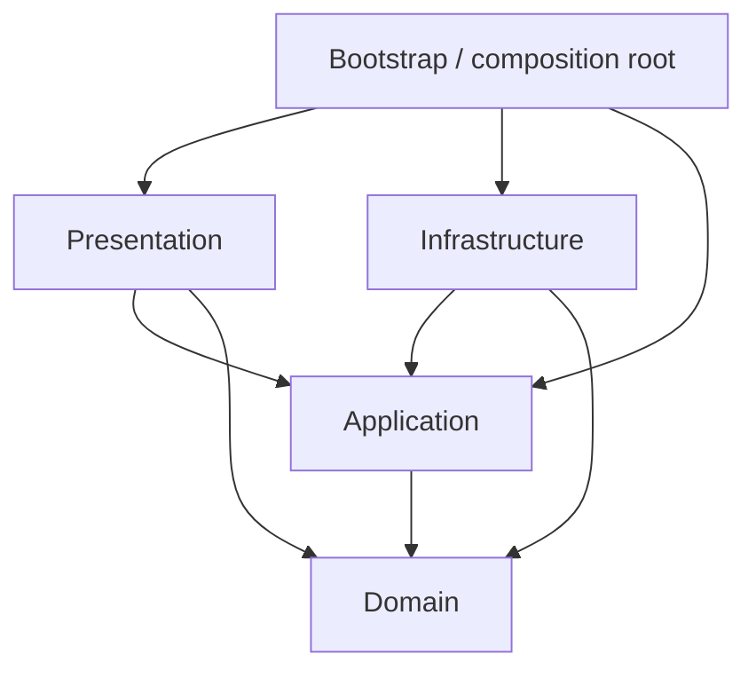

# Architecture

Status: implemented. React presentation, application session, independent domain, and injected infrastructure adapters are in place. See [migration evidence](migration.md).

## Responsibilities extracted from the prototype

| Former location   | Former problem                                                                                                               | Implemented responsibility                                                     |
| ----------------- | ---------------------------------------------------------------------------------------------------------------------------- | ------------------------------------------------------------------------------ |
| `main.ts`         | Mutable globals, state transitions, file/clipboard APIs, and large HTML strings are coupled                                  | Composition root, application transitions, browser adapters, and UI components |
| `data.ts`         | Papa Parse, domain validation, translated messages, and output formatting share one module                                   | CSV adapter, registration domain, issue presentation, and export formatter     |
| `planner.ts`      | Domain code imports `data.ts`, transitively bringing in a parser; scoring, search, reconciliation, and text export are mixed | Independent planning domain, application reconciliation, and export formatting |
| `planner-view.ts` | Deeply nested templates combine data derivation with markup and escaping                                                     | Typed view models and small declarative components                             |
| Stylesheets       | Dense rules make layout changes and ownership difficult to review                                                            | Formatted foundation styles and component-scoped styles                        |
| Tests             | Useful behaviour coverage exists, but application state transitions and browser boundaries have gaps                         | Preserve domain tests and add targeted application/component/browser tests     |

The aim is independently changeable responsibilities, not a prescribed number of files or a class hierarchy. Pure functions and explicit data are the default. Introduce interfaces where an external effect or interchangeable implementation needs a boundary.

## Dependency rule

Source-code dependencies point inward. Runtime calls may cross outward through interfaces owned by the application layer.



| Layer          | May import                                                 | Must not import                                                      |
| -------------- | ---------------------------------------------------------- | -------------------------------------------------------------------- |
| Domain         | Other domain modules and language primitives               | Application, UI, adapters, React, Papa Parse, browser APIs           |
| Application    | Domain and application-owned contracts                     | Presentation, concrete adapters, React, DOM APIs                     |
| Infrastructure | Application contracts, domain types, external libraries    | Presentation                                                         |
| Presentation   | Application API, domain types, React, presentation modules | Concrete CSV/clipboard adapters; business rules hidden in components |
| Bootstrap      | All layers to assemble dependencies                        | Business policy implemented in startup code                          |

This is an application-level modular structure, not a monorepo. Do not create packages or separate deployment units for the layers.

## Source layout

The source directories below exist. Export preparation lives in session selectors; commands live in the session controller.

```text
src/
  bootstrap/                  # Build adapters, controller, and mount React
    main.tsx
  domain/
    registration/             # Registration IDs, answers, validation, categories
    planning/                 # Disciplines, allocations, conflicts, optimiser
  application/
    imports/                  # Parse/confirm workflows and mapping contracts
    session/                  # Session state, commands, transitions, selectors
    planning/                 # Move/optimise/reconcile use cases
    ports/                    # CSV parser, text output, injected clock contracts
  infrastructure/
    csv/                      # Papa Parse implementation, ordinal column identity
    browser/                  # File reading, clipboard, print integration
    exports/                  # Plain-text formatting of export models
  presentation/
    app/                      # Shell, navigation, application provider
    features/
      import/
      registrations/
      overview/
      planning/
      contest/
    components/               # Only genuinely shared visual components
    messages/                 # de-CH labels and issue descriptions
    styles/                   # Tokens, base styles, print styles
  demo/                       # Fictional input data only
```

Tests live in `tests/`, with an independent small CSV fixture and production workflows in `tests/browser/`. Do not put unrelated code into a global `utils.ts` or `services.ts`.

## Domain model

Use English identifiers with business meaning. Core types include `RegistrationId`, `Registration`, `ParticipationAnswer`, `CompetitionCategory`, `CompetitionPart`, `CategoryPlan`, and `PlanningConflict`.

- Registration identity must include the import/session identity plus source row identity. Never merge by email or name automatically.
- Keep raw source records and column provenance beside, rather than inside, every scheduling object. Planning needs IDs and discipline membership, not email addresses or all raw cells.
- Translate `Aktive` to a stable internal category key such as `active`; retain `35+` as a display label for `masters35`. Unknown mappings remain explicit.
- A plan is scoped to a category; a discipline ID must not collide across categories. Retain original labels for display.
- Represent expected validation findings as structured issue codes, severity, registration/column references, and parameters. Translate them in presentation and export adapters.
- Pass today's date into birthday validation. A pure validator must not read `Date.now()` internally.
- Use readonly input contracts. Copy a `Map` or `Set` before editing state; TypeScript `ReadonlyMap` alone does not prevent mutation through another alias.

`SearchResult` distinguishes `primaryOptimality: proven | unproven`, completion (`complete`, `budget-exhausted`, `heuristic`, or `edited`), and conflict score. Proven optimality refers only to the conflict objective, not every tie-break objective. The optimiser retains the bounded exact/heuristic algorithm and budget documented in the product rules.

## Application state and workflows

One in-memory session owns imported records, confirmed mappings, excluded registration IDs, category overrides, allocations, and transfer checkmarks. Filters, active tabs, expanded cards, and focus are presentation state. Counts, conflicts, selected rosters, and export models are derived selectors, not separately writable copies.

Use a discriminated lifecycle (`empty`, `mapping`, `ready`) so a ready session cannot exist without confirmed input and allocations. Keep pending import attempts/errors separate from the last valid session. Check the import request ID before accepting an asynchronous result; reset invalidates pending imports.

The application exposes explicit commands rather than DOM events. A functional controller or a reducer with injected effect functions is sufficient; no dependency-injection framework is required.

| Command                  | Policy                                                                            |
| ------------------------ | --------------------------------------------------------------------------------- |
| Import CSV               | Parse to an ordinal table; replace session only on successful input preparation   |
| Confirm mapping          | Validate fields, normalise records, initialise independent category plans         |
| Change record selection  | Reconcile plans while preserving surviving assignments; clear transfer marks      |
| Move discipline          | Validate category, discipline, and part; copy affected plan; clear transfer marks |
| Optimise category        | Replace this category only; recompute result metadata; clear transfer marks       |
| Change category override | Rebuild category rosters, reconcile assignments, clear transfer marks             |
| Change column mapping    | Return to mapping and reset selected/transfer/planning state as documented        |
| Copy preparation         | Build the current export model, format it, invoke clipboard on user action        |
| Discard session          | Clear records, plans, overrides, marks, and outstanding request identity          |

Example path: `DisciplineCard` emits a typed move command; the application verifies it and returns the next state; pure selectors calculate conflicts; React renders the new cards and names. The component never modifies `plan.assignments` or calculates the conflict score.

## Boundary contracts

Application-owned contracts are defined in `application/imports/model.ts` and `application/ports/browser.ts`. `CsvTable` retains positional headings and rows, `ParseResult` distinguishes successful input from structured parse failures, and `ApplicationPorts` injects parsing, time, text formatting, clipboard, and print effects. `ImportInput` exposes a name, size, and asynchronous text reader without depending on `File`.

Application code depends on these contracts, not `Papa.parse`, `File`, or `navigator`. Bootstrap constructs concrete adapters and injects them. Keep synchronous domain functions synchronous. The parser adapter preserves duplicate headings, quoting, BOM handling, empty-cell semantics, and malformed-row diagnostics.

Plain-text export is a presentation adapter over a shared export model. The on-screen Contest view and copied output use the same selected records and current allocations. Print is triggered through a browser adapter and uses presentation print styles.

## UI and errors

Use small React components for the shell, import mapping, registration table, category switch, part column, discipline card, and conflict list. Feature hooks connect to the application API; they must not become a second business layer. Keep form fields controlled and preserve focus when moving a card. Category keys and registration IDs provide stable component keys.

Expected input issues remain visible and recoverable. Clipboard rejection reports failure without marking records as transferred. Unexpected errors must not become empty tables or successful zero totals. Show safe messages without logging imported records remotely. Imported strings render as text; do not use `dangerouslySetInnerHTML`.

## Performance and verification boundaries

Keep optimisation deterministic and expose a search budget. Benchmark realistic and larger fictional datasets before increasing that budget. If measured work blocks interaction, execute the same pure optimiser in a worker through an application port, with cancellation and stale-result protection. A worker is a conditional extension, not a current dependency.

Domain tests run without a DOM. Application tests exercise lifecycle transitions with fake adapters. CSV adapter tests check actual parser behaviour. Component tests exercise labels, focus, and commands; browser tests cover import-to-planning-to-export on a static production build, including a repository subpath.

ESLint enforces inward imports, including type-only imports and the reserved `@/` source alias. A separate `tsconfig.core.json` compiles domain/application with ES2022 libraries and no DOM types. `pnpm check` runs these gates, formatting, unit/component tests, and the build. `pnpm test:e2e` runs Chromium against a production build at `/turnfest/`. CI runs both. See [code standards](code-standards.md).
